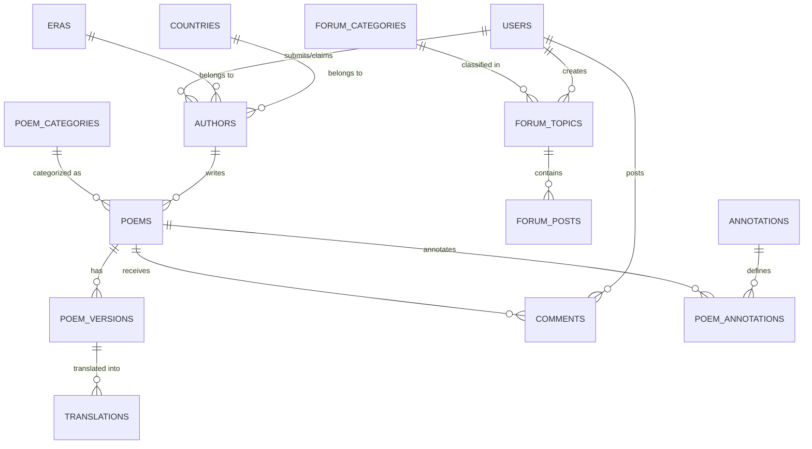

# Thiết kế Cơ sở Dữ liệu (Database Schema Design)

Hệ thống **Thi Viện (Modern Clone)** yêu cầu một cơ sở dữ liệu có cấu trúc quan hệ chặt chẽ, tối ưu hóa cho truy vấn văn bản, phân cấp phức tạp (chữ Hán, phiên âm, dịch nghĩa, dịch thơ) và hỗ trợ mở rộng cho mạng xã hội/diễn đàn thơ ca thành viên.

**PostgreSQL** được lựa chọn làm hệ quản trị cơ sở dữ liệu chính nhờ hiệu năng vượt trội, hỗ trợ toàn vẹn tham chiếu mạnh mẽ, kiểu dữ liệu JSONB linh hoạt, các truy vấn đệ quy (Recursive CTEs) cực tốt cho cây bình luận/diễn đàn, và tích hợp sẵn công cụ Full-Text Search chất lượng cao.

---

## 1. Sơ đồ Quan hệ Thực thể (ERD)

Dưới đây là mô hình các thực thể chính trong hệ thống và mối liên kết giữa chúng:



---

## 2. Chi tiết các Bảng & SQL DDL

Dưới đây là tập hợp toàn bộ câu lệnh khởi tạo bảng (SQL DDL) cùng kiểu dữ liệu, ràng buộc và mô tả chi tiết:

### 2.1. Nhóm Danh mục & Cấu trúc Nền tảng

```sql
-- 1. Bảng Quốc gia (Countries)
CREATE TABLE countries (
    id SERIAL PRIMARY KEY,
    name VARCHAR(100) NOT NULL UNIQUE,      -- Tên quốc gia (VD: Việt Nam, Trung Quốc, Pháp...)
    iso_code VARCHAR(10) UNIQUE,            -- Mã quốc gia chuẩn (VD: VN, CN, FR)
    flag_url VARCHAR(255),                  -- Đường dẫn ảnh quốc kỳ
    created_at TIMESTAMP WITH TIME ZONE DEFAULT CURRENT_TIMESTAMP
);

-- 2. Bảng Thời kỳ / Triều đại (Eras / Periods)
CREATE TABLE eras (
    id SERIAL PRIMARY KEY,
    name VARCHAR(100) NOT NULL UNIQUE,      -- Tên thời kỳ (VD: Đường triều, Tống triều, Hiện đại...)
    description TEXT,                       -- Mô tả sơ lược về lịch sử văn học thời kỳ đó
    start_year INTEGER,                     -- Năm bắt đầu ước tính (dành cho bộ lọc thời gian)
    end_year INTEGER,                       -- Năm kết thúc ước tính
    created_at TIMESTAMP WITH TIME ZONE DEFAULT CURRENT_TIMESTAMP
);

-- 3. Bảng Chuyên mục / Thể loại Thơ (Poem Categories)
CREATE TABLE poem_categories (
    id SERIAL PRIMARY KEY,
    name VARCHAR(100) NOT NULL UNIQUE,      -- Tên thể loại (VD: Thơ Đường luật, Tống từ, Lục bát, Tự do...)
    slug VARCHAR(100) NOT NULL UNIQUE,      -- Đường dẫn thân thiện (VD: tho-duong-luat, tong-tu)
    description TEXT,
    created_at TIMESTAMP WITH TIME ZONE DEFAULT CURRENT_TIMESTAMP
);
```

### 2.2. Nhóm Người dùng & Tác giả

```sql
-- 4. Bảng Người dùng (Users)
CREATE TABLE users (
    id SERIAL PRIMARY KEY,
    username VARCHAR(50) NOT NULL UNIQUE,
    email VARCHAR(100) NOT NULL UNIQUE,
    password_hash VARCHAR(255) NOT NULL,
    display_name VARCHAR(100) NOT NULL,
    avatar_url VARCHAR(255),
    role VARCHAR(20) NOT NULL DEFAULT 'member', -- Chức năng: admin, moderator, poet, member
    vn_typing_mode INT DEFAULT 3,               -- Chế độ gõ mặc định (1: Telex, 2: VNI, 3: Tự động, 0: Tắt)
    theme_preference VARCHAR(20) DEFAULT 'system',-- Giao diện: light, dark, sepia, system
    font_preference VARCHAR(50) DEFAULT 'Lora',  -- Kiểu chữ đọc thơ ưa thích
    is_active BOOLEAN DEFAULT TRUE,
    created_at TIMESTAMP WITH TIME ZONE DEFAULT CURRENT_TIMESTAMP,
    updated_at TIMESTAMP WITH TIME ZONE DEFAULT CURRENT_TIMESTAMP
);

-- 5. Bảng Tác giả / Dịch giả (Authors)
CREATE TABLE authors (
    id SERIAL PRIMARY KEY,
    name VARCHAR(150) NOT NULL,             -- Tên hiển thị chính (VD: Nguyễn Du, Lý Bạch)
    slug VARCHAR(150) NOT NULL UNIQUE,      -- Slug phục vụ SEO URL
    real_name VARCHAR(150),                 -- Tên thật / Tự / Hiệu
    birth_year VARCHAR(50),                 -- Năm sinh (dạng chuỗi vì có thể không rõ ràng hoặc trước Công Nguyên)
    death_year VARCHAR(50),                 -- Năm mất
    country_id INTEGER REFERENCES countries(id) ON DELETE SET NULL,
    era_id INTEGER REFERENCES eras(id) ON DELETE SET NULL,
    biography TEXT,                         -- Tiểu sử chi tiết dạng Markdown
    portrait_url VARCHAR(255),              -- Ảnh chân dung tác giả
    view_count INTEGER DEFAULT 0,
    is_verified BOOLEAN DEFAULT FALSE,      -- Được xác minh bởi Quản trị viên (tránh trùng lặp nội dung rác)
    created_by INTEGER REFERENCES users(id) ON DELETE SET NULL, -- Thành viên đóng góp dữ liệu tác giả
    created_at TIMESTAMP WITH TIME ZONE DEFAULT CURRENT_TIMESTAMP,
    updated_at TIMESTAMP WITH TIME ZONE DEFAULT CURRENT_TIMESTAMP
);
```

### 2.3. Nhóm Tác phẩm Thơ & Dị bản & Dịch thuật

```sql
-- 6. Bảng Tác phẩm chính (Poems)
CREATE TABLE poems (
    id SERIAL PRIMARY KEY,
    title VARCHAR(255) NOT NULL,            -- Tiêu đề bài thơ
    slug VARCHAR(255) NOT NULL UNIQUE,
    author_id INTEGER NOT NULL REFERENCES authors(id) ON DELETE CASCADE,
    category_id INTEGER REFERENCES poem_categories(id) ON DELETE SET NULL,
    era_id INTEGER REFERENCES eras(id) ON DELETE SET NULL,
    source_info VARCHAR(255),               -- Xuất xứ tác phẩm (VD: Thanh Hiên thi tập, Toàn Đường Thi)
    view_count INTEGER DEFAULT 0,
    is_member_poem BOOLEAN DEFAULT FALSE,   -- TRUE: Thơ tự sáng tác của thành viên, FALSE: Thơ sưu tầm chính thống
    status VARCHAR(20) NOT NULL DEFAULT 'published', -- Trạng thái: draft (nháp), pending (chờ duyệt), published (xuất bản)
    created_by INTEGER REFERENCES users(id) ON DELETE SET NULL,
    created_at TIMESTAMP WITH TIME ZONE DEFAULT CURRENT_TIMESTAMP,
    updated_at TIMESTAMP WITH TIME ZONE DEFAULT CURRENT_TIMESTAMP
);

-- 7. Bảng Dị bản / Phiên bản bài thơ (Poem Versions)
-- Một bài thơ có thể có các dị bản khác nhau hoặc các phiên bản trình bày khác nhau (Chữ Hán, Phiên âm...)
CREATE TABLE poem_versions (
    id SERIAL PRIMARY KEY,
    poem_id INTEGER NOT NULL REFERENCES poems(id) ON DELETE CASCADE,
    version_name VARCHAR(100) DEFAULT 'Bản chuẩn', -- Tên dị bản (VD: Bản thủ bản, Dị bản theo Toàn Đường Thi)
    content TEXT NOT NULL,                  -- Nội dung thơ nguyên tác (Chữ Quốc ngữ hoặc Chữ Hán/Nôm nguyên bản)
    transcription TEXT,                     -- Phiên âm tiếng Việt (cực kỳ quan trọng đối với chữ Hán / Đường thi)
    explanation TEXT,                       -- Dịch nghĩa đen từng câu chữ
    is_primary BOOLEAN DEFAULT TRUE,        -- Bản hiển thị chính mặc định
    created_at TIMESTAMP WITH TIME ZONE DEFAULT CURRENT_TIMESTAMP
);

-- 8. Bảng Các bản dịch thơ (Translations)
-- Một dị bản thơ chữ Hán có thể có hàng chục bản dịch thơ lục bát, song thất lục bát của nhiều dịch giả khác nhau
CREATE TABLE translations (
    id SERIAL PRIMARY KEY,
    poem_version_id INTEGER NOT NULL REFERENCES poem_versions(id) ON DELETE CASCADE,
    translator_id INTEGER REFERENCES authors(id) ON DELETE SET NULL, -- Dịch giả (có thể là tác giả trong hệ thống)
    translator_user_id INTEGER REFERENCES users(id) ON DELETE SET NULL, -- Hoặc thành viên hệ thống tự dịch
    translation_title VARCHAR(255),         -- Tên bài thơ dịch (thường trùng hoặc biến thể)
    content TEXT NOT NULL,                  -- Nội dung bài dịch
    translation_type VARCHAR(50) DEFAULT 'Thơ', -- Loại dịch: Thơ lục bát, Song thất lục bát, Thơ tự do, Dịch xuôi...
    is_favorite BOOLEAN DEFAULT FALSE,      -- Đánh dấu bản dịch được bình chọn/yêu thích nhất để hiển thị hàng đầu
    created_at TIMESTAMP WITH TIME ZONE DEFAULT CURRENT_TIMESTAMP
);
```

### 2.4. Nhóm Điển tích & Chú giải Tự động (Từ điển Hán Việt)

```sql
-- 9. Bảng Thư viện Giải nghĩa Chung (Annotations)
-- Lưu trữ các điển cố, điển tích, địa danh, từ khó dùng chung để tái sử dụng trên toàn hệ thống
CREATE TABLE annotations (
    id SERIAL PRIMARY KEY,
    keyword VARCHAR(100) NOT NULL UNIQUE,   -- Từ khóa khó / Điển tích (VD: Tố Như, Quỳnh Hải, gạo châu củi quế)
    explanation TEXT NOT NULL,              -- Nội dung giải nghĩa chi tiết
    type VARCHAR(50) NOT NULL DEFAULT 'vocabulary', -- Loại từ: vocabulary (từ khó), allusion (điển cố/điển tích), location (địa danh)
    source VARCHAR(255),                    -- Nguồn tham chiếu (Từ điển Hán Việt Thiều Chửu, Đào Duy Anh...)
    created_by INTEGER REFERENCES users(id) ON DELETE SET NULL,
    created_at TIMESTAMP WITH TIME ZONE DEFAULT CURRENT_TIMESTAMP
);

-- 10. Bảng Bản đồ Chú giải bài thơ (Poem Annotations)
-- Liên kết từ khóa chú giải với từng bài thơ để frontend tự động làm nổi bật (highlight) và hiện popover giải nghĩa khi hover chuột
CREATE TABLE poem_annotations (
    poem_id INTEGER NOT NULL REFERENCES poems(id) ON DELETE CASCADE,
    annotation_id INTEGER NOT NULL REFERENCES annotations(id) ON DELETE CASCADE,
    PRIMARY KEY (poem_id, annotation_id)
);
```

### 2.5. Nhóm Tương tác Xã hội & Diễn đàn

```sql
-- 11. Bảng Bình luận (Comments)
CREATE TABLE comments (
    id SERIAL PRIMARY KEY,
    entity_type VARCHAR(20) NOT NULL,       -- Loại thực thể được bình luận: 'poem', 'author', 'forum_topic'
    entity_id INTEGER NOT NULL,             -- ID tương ứng của poem_id, author_id hoặc topic_id
    user_id INTEGER REFERENCES users(id) ON DELETE SET NULL, -- NULL nếu là khách (vãng lai) bình luận nhanh
    guest_name VARCHAR(100),                -- Lưu tên nếu là khách bình luận tự do (Tính năng mới của Thi Viện)
    guest_email VARCHAR(100),
    content TEXT NOT NULL,
    status VARCHAR(20) DEFAULT 'approved',  -- Trạng thái kiểm duyệt: pending (chờ duyệt), approved (đã duyệt), spam (rác)
    parent_id INTEGER REFERENCES comments(id) ON DELETE CASCADE, -- Hỗ trợ bình luận phân cấp hình cây (Nested Comments)
    created_at TIMESTAMP WITH TIME ZONE DEFAULT CURRENT_TIMESTAMP
);

-- 12. Bảng Chuyên mục Diễn đàn (Forum Categories)
CREATE TABLE forum_categories (
    id SERIAL PRIMARY KEY,
    name VARCHAR(150) NOT NULL UNIQUE,
    slug VARCHAR(150) NOT NULL UNIQUE,
    description TEXT,
    display_order INTEGER DEFAULT 0,
    created_at TIMESTAMP WITH TIME ZONE DEFAULT CURRENT_TIMESTAMP
);

-- 13. Bảng Chủ đề Diễn đàn (Forum Topics)
CREATE TABLE forum_topics (
    id SERIAL PRIMARY KEY,
    category_id INTEGER NOT NULL REFERENCES forum_categories(id) ON DELETE CASCADE,
    user_id INTEGER NOT NULL REFERENCES users(id) ON DELETE CASCADE,
    title VARCHAR(255) NOT NULL,
    slug VARCHAR(255) NOT NULL UNIQUE,
    view_count INTEGER DEFAULT 0,
    is_pinned BOOLEAN DEFAULT FALSE,        -- Ghim chủ đề lên đầu chuyên mục
    is_locked BOOLEAN DEFAULT FALSE,        -- Khóa không cho bình luận tiếp
    created_at TIMESTAMP WITH TIME ZONE DEFAULT CURRENT_TIMESTAMP,
    updated_at TIMESTAMP WITH TIME ZONE DEFAULT CURRENT_TIMESTAMP
);

-- 14. Bảng Bài viết trong Chủ đề (Forum Posts)
CREATE TABLE forum_posts (
    id SERIAL PRIMARY KEY,
    topic_id INTEGER NOT NULL REFERENCES forum_topics(id) ON DELETE CASCADE,
    user_id INTEGER NOT NULL REFERENCES users(id) ON DELETE CASCADE,
    content TEXT NOT NULL,                  -- Nội dung bài viết diễn đàn (hỗ trợ Rich Text / Markdown)
    parent_id INTEGER REFERENCES forum_posts(id) ON DELETE CASCADE,
    created_at TIMESTAMP WITH TIME ZONE DEFAULT CURRENT_TIMESTAMP,
    updated_at TIMESTAMP WITH TIME ZONE DEFAULT CURRENT_TIMESTAMP
);

-- 15. Bảng Yêu thích / Lưu trữ (Favorites / Bookmarks)
CREATE TABLE bookmarks (
    user_id INTEGER NOT NULL REFERENCES users(id) ON DELETE CASCADE,
    poem_id INTEGER NOT NULL REFERENCES poems(id) ON DELETE CASCADE,
    created_at TIMESTAMP WITH TIME ZONE DEFAULT CURRENT_TIMESTAMP,
    PRIMARY KEY (user_id, poem_id)
);
```

---

## 3. Chiến lược Đánh Chỉ mục & Tối ưu hóa Truy vấn (Performance & Indexes)

Để trang web phản hồi siêu tốc với cơ sở dữ liệu lớn (hàng trăm ngàn bản ghi thơ), các chỉ mục sau đây bắt buộc phải được thiết lập:

### 3.1. Chỉ mục Tìm kiếm Toàn văn (Full-Text Search Index)
PostgreSQL hỗ trợ công cụ tìm kiếm mạnh mẽ bằng `tsvector`. Chúng ta sẽ tối ưu tìm kiếm đồng thời tiêu đề, nguyên tác, phiên âm và nội dung dịch bằng việc kết hợp các trường và đánh chỉ mục `GIN` (Generalized Inverted Index):

```sql
-- Thêm cột tsvector tối ưu tìm kiếm cho bài thơ
ALTER TABLE poem_versions ADD COLUMN search_vector tsvector;

-- Cập nhật tự động search_vector từ các trường content và transcription
CREATE OR REPLACE FUNCTION poem_versions_search_trigger() RETURNS trigger AS $$
begin
  new.search_vector :=
     setweight(to_tsvector('simple', coalesce(new.version_name,'')), 'C') ||
     setweight(to_tsvector('simple', coalesce(new.content,'')), 'A') ||
     setweight(to_tsvector('simple', coalesce(new.transcription,'')), 'B') ||
     setweight(to_tsvector('simple', coalesce(new.explanation,'')), 'D');
  return new;
end
$$ LANGUAGE plpgsql;

CREATE TRIGGER tsvectorupdate BEFORE INSERT OR UPDATE
ON poem_versions FOR EACH ROW EXECUTE FUNCTION poem_versions_search_trigger();

-- Đánh chỉ mục GIN cho cột search_vector để tìm kiếm phản hồi < 5ms
CREATE INDEX idx_poems_search_vector ON poem_versions USING gin(search_vector);
```

### 3.2. Chỉ mục Truy vấn Nhanh (Indexes for Relations & Filters)
Bổ sung các chỉ mục B-Tree chuẩn cho các khóa ngoại và trường thường xuyên được sử dụng làm bộ lọc hoặc sắp xếp:

```sql
-- Tối ưu hóa tìm kiếm theo SEO Slug
CREATE INDEX idx_users_username ON users(username);
CREATE INDEX idx_authors_slug ON authors(slug);
CREATE INDEX idx_poems_slug ON poems(slug);
CREATE INDEX idx_forum_topics_slug ON forum_topics(slug);

-- Tối ưu hóa bộ lọc Thơ (lọc theo tác giả, thời kỳ, thể loại)
CREATE INDEX idx_poems_author_id ON poems(author_id);
CREATE INDEX idx_poems_category_id ON poems(category_id);
CREATE INDEX idx_poems_era_id ON poems(era_id);
CREATE INDEX idx_poems_is_member_poem ON poems(is_member_poem);
CREATE INDEX idx_poems_status ON poems(status);

-- Tối ưu hóa truy vấn hiển thị Bản dịch
CREATE INDEX idx_translations_poem_version_id ON translations(poem_version_id);
CREATE INDEX idx_translations_is_favorite ON translations(is_favorite) WHERE is_favorite = TRUE;

-- Tối ưu hóa hệ thống bình luận cây đệ quy
CREATE INDEX idx_comments_entity ON comments(entity_type, entity_id);
CREATE INDEX idx_comments_parent_id ON comments(parent_id);

-- Tối ưu hóa danh sách bài viết diễn đàn
CREATE INDEX idx_forum_posts_topic_id ON forum_posts(topic_id);
```

---

*Lược đồ cơ sở dữ liệu này được thiết kế chuẩn chỉnh, sẵn sàng import trực tiếp vào PostgreSQL để khởi tạo hệ thống lưu trữ bền vững cho ứng dụng Thi Viện Clone.*
