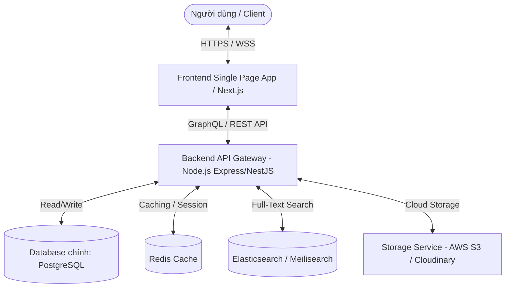

# Thi Viện Spec - Project Overview & Design System

Dự án **Thi Viện (Modern Clone)** nhằm mục đích tái cấu trúc toàn diện thư viện thơ ca lớn nhất Việt Nam (thivien.net). Với việc gìn giữ giá trị cốt lõi là kho tàng tri thức khổng lồ về thơ ca cổ điển, Đường thi, thơ hiện đại, và thơ thành viên, phiên bản clone này sẽ được nâng cấp vượt bậc về mặt **trải nghiệm người dùng (UX)**, **giao diện (UI)** hiện đại mang âm hưởng văn hoá Đông Á tinh tế, cùng hệ thống kiến trúc backend mạnh mẽ, bảo mật và mở rộng tốt.

Tài liệu này đóng vai trò là bản đặc tả kỹ thuật chi tiết của toàn bộ hệ thống.

---

## 1. Tầm nhìn & Mục tiêu Giao diện mới (UX/UI Vision)

### Giao diện Hiện tại (Thivien.net)
* **Ưu điểm**: Dữ liệu đồ sộ, tốc độ tải nhanh nhờ HTML tĩnh/tối giản, cấu trúc phân cấp tương đối rõ ràng.
* **Nhược điểm**: Thiết kế lỗi thời (sử dụng Bootstrap v3 cũ kỹ từ những năm 2010), chật chội, nhiều quảng cáo gây mất tập trung, giao diện đọc thơ chưa tối ưu cho di động, thiếu tính tương tác cao (micro-animations, dark mode sang trọng, chuyển trang mượt mà).

### Định hướng Giao diện mới (Premium & Cultural Aesthetic)
* **Ngôn ngữ Thiết kế**: *Modern East Asian Heritage (Văn hoá Đông Á đương đại)* kết hợp với *Minimalist Functionalism (Tối giản thực dụng)*. Cảm giác như đang lật giở một cuốn sách thơ trên giấy dó cao cấp nhưng cực kỳ nhanh và mượt trên màn hình số.
* **Hệ màu chủ đạo (Color Palette)**:
  * **Hồng Cát / Warm Parchment (Light Mode)**: `#F7F4EB` (Nền chính - mô phỏng giấy cũ mục), phối cùng `#FAF8F5` (Card background). Mang lại cảm giác thư thái, dễ chịu cho mắt khi đọc thơ lâu.
  * **Đỏ Sơn Mài / Cinnabar Red (Accent Color)**: `#8E2424` hoặc `#A83232`. Màu đỏ truyền thống sâu lắng làm điểm nhấn cho logo, các nút hành động quan trọng, hoặc thẻ tiêu đề bài thơ.
  * **Xám Đá / Charcoal Slate (Dark Mode)**: `#121214` (Nền chính) phối cùng `#1E1E22` (Card background). Màu chữ vàng nhạt `#EAE3D2` hoặc trắng ngà `#D8D3C5` để tạo độ tương phản dịu mắt ban đêm.
  * **Xanh Lục Trúc / Bamboo Green**: `#2C5E43` làm màu phụ trợ (màu của dấu tích, danh mục hoặc liên kết phụ).
* **Kiểu chữ (Typography)**:
  * Kiểu chữ Serif sang trọng cho tiêu đề và nội dung thơ: **Playfair Display**, **Lora** hoặc **EB Garamond** (font chữ có chân, nét thanh nét đậm đậm chất thi ca và cổ điển).
  * Kiểu chữ Sans-serif hiện đại cho các nhãn hệ thống, bảng điều khiển và văn bản nhỏ: **Inter** hoặc **Outfit** để đảm bảo khả năng đọc cực kỳ sắc nét trên mọi kích thước màn hình.
* **Tương tác động (Micro-interactions & Glassmorphic Elements)**:
  * Hiệu ứng mờ nhòe kính (Glassmorphism) trên thanh tìm kiếm và thanh điều hướng cố định (Sticky Navigation bar).
  * Hover mượt mà (smooth transitions, `cubic-bezier`) cho các thẻ bài thơ, nút bấm và mục lục.
  * Hiệu ứng chuyển động lật trang nhẹ nhàng hoặc trượt mượt mà khi đổi giữa các bản dịch thơ và nguyên tác.

---

## 2. Kiến trúc Hệ thống đề xuất (System Architecture)

Hệ thống được thiết kế theo mô hình **Decoupled Architecture (Tách biệt hoàn toàn Frontend & Backend)** để đảm bảo khả năng mở rộng và hiệu năng cao nhất:

### Frontend Stack:
* **Framework**: **Next.js (App Router)** hoặc **Vite + React** với TypeScript. Next.js được ưu tiên hàng đầu nhờ tính năng **Server-Side Rendering (SSR)** và **Incremental Static Regeneration (ISR)** - cực kỳ quan trọng đối với một website có hàng trăm ngàn bài thơ tĩnh để tối ưu SEO 100% lên top Google.
* **Styling**: **Vanilla CSS / CSS Modules** kết hợp với **CSS Variables** để quản lý hệ thống design token cực kỳ linh hoạt (Light/Dark Mode).
* **State Management**: **Zustand** (nhẹ, nhanh) và **React Query (TanStack Query)** để cache và quản lý dữ liệu API mượt mà ở phía client.

### Backend Stack:
* **Language & Runtime**: **Node.js (NestJS)** hoặc **Go (Fiber/Gin)** để có tốc độ xử lý vượt trội và khả năng concurrency cao khi xử lý lượng lớn lượt truy cập cùng lúc.
* **Database**: **PostgreSQL** là lựa chọn tối ưu cho mô hình dữ liệu quan hệ chặt chẽ giữa tác giả, tác phẩm, dị bản, dịch giả, thẻ thơ, diễn đàn.
* **Search Engine**: **Meilisearch** hoặc **Elasticsearch** để thay thế tính năng tìm kiếm phức tạp hiện tại. Meilisearch rất dễ tích hợp, hỗ trợ tìm kiếm mờ (fuzzy search) tiếng Việt có dấu cực tốt, phản hồi chỉ trong vài phần nghìn giây.
* **Caching**: **Redis** được cấu hình để cache các bài thơ được đọc nhiều nhất, danh sách tác giả nổi bật và phiên đăng nhập của người dùng.

---

## 3. Bản đồ các tài liệu Đặc tả (Documentation Map)

Để thuận tiện cho việc phát triển, tài liệu được phân chia thành các file cụ thể nằm trong thư mục `docs/`:

1. **[Tài liệu Tổng quan & Ngôn ngữ Thiết kế (overview.md)](file:///Users/hongtam/Downloads/d%E1%BB%B1%20%C3%A1n%20nh%E1%BB%8F%20m%E1%BB%9Bi%20ai/khoahoc/tho/docs/overview.md)**: Giới thiệu tầm nhìn, bảng màu, kiểu chữ, kiến trúc hệ thống tổng quát *(Tài liệu hiện tại)*.
2. **[Thiết kế Cơ sở Dữ liệu (database.md)](file:///Users/hongtam/Downloads/d%E1%BB%B1%20%C3%A1n%20nh%E1%BB%8F%20m%E1%BB%9Bi%20ai/khoahoc/tho/docs/database.md)**: Chi tiết cấu trúc các bảng (Tables), mối quan hệ (Relationships), lược đồ dữ liệu (Schema DB) và chiến lược đánh chỉ mục (Index) tối ưu hóa truy vấn thơ.
3. **[Tài liệu Đặc tả API CRUD (api.md)](file:///Users/hongtam/Downloads/d%E1%BB%B1%20%C3%A1n%20nh%E1%BB%8F%20m%E1%BB%9Bi%20ai/khoahoc/tho/docs/api.md)**: Chi tiết các endpoint, tham số truyền vào, dữ liệu trả về cho các chức năng CRUD Tác phẩm, Tác giả, Bình luận, Sáng tác thành viên và Tìm kiếm nâng cao.
4. **[Đặc tả Giao diện & Prompt Stitch (frontend.md)](file:///Users/hongtam/Downloads/d%E1%BB%B1%20%C3%A1n%20nh%E1%BB%8F%20m%E1%BB%9Bi%20ai/khoahoc/tho/docs/frontend.md)**: Sơ đồ luồng di chuyển (Navigation), cấu trúc các màn hình chính và đặc biệt là danh sách các **Prompt tối ưu cao (High-Fidelity UI Prompts)** viết chi tiết cho từng màn hình để dán trực tiếp vào **Stitch with Google** tạo giao diện tuyệt mỹ.

---

*Vui lòng lật mở các chương tiếp theo trong thư mục `docs/` để bắt đầu khám phá thiết kế chi tiết.*
